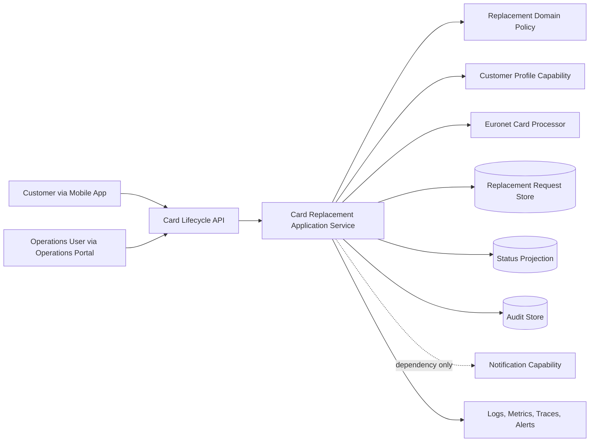

# Card Replacement Design

## Metadata

| Field | Value |
| --- | --- |
| Design ID | DES-CARDREP-001 |
| Spec ID | SPEC-CARDREP-001 |
| Intent ID | INT-CARDREP-001 |
| Domain | Cards |
| Capability | Card Lifecycle Management |
| Feature | Card Replacement |
| Owner | Cards Squad |
| Status | Draft for Architect Review |
| Source Intent | `domains/cards/capabilities/card-lifecycle-management/features/card-replacement/intent/intent.md` |
| Source Specification | `domains/cards/capabilities/card-lifecycle-management/features/card-replacement/specification/specification.md` |
| Source Capability Context | `domains/cards/capabilities/card-lifecycle-management/capability-context.md` |

## 1. Solution Overview

Card Replacement provides the pilot replacement journey for lost, stolen, and damaged cards under Card Lifecycle Management.

The solution exposes customer and operations replacement commands through the Card Lifecycle API boundary. It validates actor authorization, channel scope, replacement reason, card eligibility, and confirmed delivery address before accepting a replacement request. For Lost Card and Stolen Card requests, Card Replacement directly coordinates with the Euronet Card Processor to block the existing card before the replacement request can proceed to successful submission. Damaged Card replacement does not require card blocking unless Euronet rules require blocking for the card or product.

Card Replacement owns the replacement workflow record, customer-safe and operations-only status mapping, processor coordination references, replacement audit evidence, and lifecycle events produced for replacement outcomes. It consumes Customer Profile context for address confirmation and customer eligibility, and records Notification Capability as a dependency. Detailed notification behavior remains out of scope for this design iteration.

Card Controls remains outside the design scope. Standalone block, unblock, usage-control, and limit-control journeys are not implemented or owned by Card Replacement.

## 2. Context Diagram

## 3. Component Responsibilities

| Component | Responsibility | Ownership |
| --- | --- | --- |
| Mobile App replacement journey | Capture customer replacement reason, address confirmation, and status view for customer-safe statuses only. | Channel Platform / Cards Squad |
| Operations Portal replacement journey | Capture operations-user replacement requests and expose operations-approved status details. | Operations owner / Cards Squad |
| Card Lifecycle API | Provide the Card Replacement command and query boundary. Concrete OpenAPI contracts are not created in this design iteration. | Cards Squad |
| Card Replacement Application Service | Orchestrate validation, customer profile lookup, Euronet coordination, request creation, status updates, audit, and event publication. | Cards Squad |
| Replacement Domain Policy | Enforce allowed channels, reasons, address confirmation, fee behavior, maker-checker exclusion, card eligibility, and blocking requirements. | Cards Squad |
| Euronet Adapter | Encapsulate Euronet blocking and replacement coordination calls, processor references, technical errors, and retry-safe behavior. | Cards Squad with Card Processor owner review |
| Customer Profile Adapter | Retrieve approved customer and address context needed for eligibility and address confirmation. | Customer Profile Capability owner |
| Replacement Request Store | Persist replacement request reference, actor, channel, reason, card reference, address reference, processor reference, statuses, timestamps, and correlation ID. | Cards Squad |
| Status Projection | Provide actor-safe mapping from internal replacement state to customer-safe and operations-only status values. | Cards Squad |
| Audit Publisher / Store | Capture durable audit evidence for material replacement actions and denied attempts. | Audit platform owner / Cards Squad |
| Event Publisher | Emit approved Card Lifecycle Management replacement events after durable state and audit evidence exist. | Cards Squad |
| Notification Port | Record dependency on Notification Capability where future approved notification behavior is required. | Notification Capability owner |
| Observability | Provide logs, metrics, traces, and alerts for replacement and processor coordination behavior. | Cards Squad / Platform owner |

## 4. Sequence Flow

### Replacement Submission

1. Customer or Operations User initiates Card Replacement through an approved pilot channel.
2. Channel calls the Card Lifecycle API with actor identity, channel, card reference, replacement reason, confirmed address reference, and correlation metadata.
3. API authenticates the actor and verifies the actor is authorized for the channel and card.
4. Card Replacement validates:
   - channel is Mobile App or Operations Portal
   - reason is Lost Card, Stolen Card, or Damaged Card
   - card is eligible for replacement
   - delivery address has been confirmed
   - no pilot fee or maker-checker step is required
5. Card Replacement retrieves approved customer and address context from Customer Profile where needed.
6. For Lost Card or Stolen Card:
   - Card Replacement invokes Euronet to block the existing card
   - if blocking succeeds, the processor reference and outcome are captured
   - if blocking fails or is unavailable, the request does not proceed to successful submission
7. For Damaged Card:
   - Card Replacement does not invoke blocking unless Euronet rules require it for that card or product
   - if Euronet requires blocking, the Lost/Stolen fail-safe behavior applies
8. Card Replacement creates the replacement request record with a unique reference and initial traceability fields.
9. Audit evidence is persisted for submission, blocking outcome where applicable, processor coordination, and status transition.
10. Card Replacement updates the status projection and publishes approved lifecycle events where event publication is in scope.
11. API returns actor-safe response details and the replacement request reference.

### Status Inquiry

1. Customer or Operations User requests replacement status through an approved channel.
2. API authenticates the actor and verifies authorization to view the replacement request.
3. Card Replacement retrieves current replacement state and maps it to actor-safe status visibility.
4. Customer responses expose only Submitted, In Progress, Completed, or Rejected.
5. Operations responses may expose approved operations-only statuses and processor coordination evidence.
6. Unauthorized status requests are rejected without disclosing sensitive details.

## 5. API Requirements

No OpenAPI contract is created by this design. The future Card Lifecycle API contract should define these resources or equivalent resources approved by the API owner:

| API Capability | Requirement Links | Design Notes |
| --- | --- | --- |
| Customer replacement submission | FR-CARDREP-001, FR-CARDREP-004 through FR-CARDREP-016, FR-CARDREP-018 through FR-CARDREP-020 | Accept Mobile App customer replacement requests for owned eligible cards only. |
| Operations replacement submission | FR-CARDREP-002, FR-CARDREP-004 through FR-CARDREP-016, FR-CARDREP-018 through FR-CARDREP-020 | Accept Operations Portal requests only from authorized operations users. |
| Customer replacement status inquiry | FR-CARDREP-017, FR-CARDREP-023 | Return customer-safe status and safe request details only. |
| Operations replacement status inquiry | FR-CARDREP-017, FR-CARDREP-023 | Return operations-approved status and processor coordination details. |

Future API contract requirements:

- Requests must include or derive actor identity, channel, card reference, replacement reason, confirmed address reference, and correlation ID.
- Command APIs must be duplicate-safe through an approved idempotency approach before implementation.
- Responses must not expose full PAN, sensitive customer data, Euronet technical details, or operations-only statuses to customers.
- Error responses must use actor-safe reasons for unsupported channel, unsupported reason, missing address confirmation, unauthorized actor, ineligible card, and processor blocking failure.
- Status APIs must enforce actor-specific authorization and status mapping.

## 6. Event Requirements

No event schema is created by this design. Event names, payloads, consumers, keys, and compatibility rules require architect, producer-owner, and consumer review.

| Event Candidate | Trigger | Purpose | Requirement Links |
| --- | --- | --- | --- |
| `CardReplacementRequested` | Replacement request is accepted and persisted. | Notify downstream consumers that a replacement workflow exists. | FR-CARDREP-016, FR-CARDREP-018, FR-CARDREP-020 |
| `CardReplacementRejected` | Replacement request is rejected before successful submission. | Provide auditable operational evidence where event publication is approved. | FR-CARDREP-003, FR-CARDREP-005, FR-CARDREP-013 through FR-CARDREP-015 |
| `CardReplacementStatusChanged` | Replacement request changes customer-safe or operations-only status. | Support status projection, monitoring, and downstream status consumers. | FR-CARDREP-017, FR-CARDREP-018, FR-CARDREP-023 |
| `CardReplaced` | Replacement reaches completed lifecycle outcome. | Record completed card replacement lifecycle outcome at capability level. | FR-CARDREP-020 |

Event payloads must use masked card references, replacement request reference, reason, channel, actor type, status, processor reference where safe, timestamp, and correlation ID. Sensitive card and customer data must not be exposed.

## 7. Integration Design

| Integration | Direction | Design Responsibility | Failure Behavior |
| --- | --- | --- | --- |
| Euronet Card Processor | Outbound command / inbound outcome | Block existing card for Lost/Stolen, coordinate processor replacement lifecycle actions, store processor references and outcomes. | Lost/Stolen replacement must not proceed to successful submission unless required blocking succeeds. |
| Customer Profile Capability | Outbound lookup | Retrieve approved customer profile and address context for eligibility and address confirmation only. | If required profile or address context is unavailable, submission is blocked or safely rejected. |
| Notification Capability | Outbound request or event, future scope | Dependency is recorded. Detailed notification behavior is out of scope for this design iteration. | Replacement processing must not assume feature-owned notification behavior in this iteration. |
| Audit Store | Outbound durable audit write | Persist material action, denial, processor outcome, and status-change evidence. | Material state change must not complete unless durable audit evidence or approved durable buffering exists. |
| Mobile App | Inbound channel | Customer replacement submission and customer-safe status visibility. | Unsupported or unauthorized requests are rejected. |
| Operations Portal | Inbound channel | Operations replacement submission and operations-only status visibility. | Missing entitlement or unsupported action is rejected. |

Euronet integration details still requiring approval:

- blocking command name, request fields, response fields, and processor reference semantics
- replacement lifecycle command scope after blocking succeeds
- timeout, retry, duplicate handling, and reconciliation behavior
- Euronet error mapping to safe customer and operations statuses
- required evidence fields for audit and validation

## 8. Data Ownership

| Data | Owner | Notes |
| --- | --- | --- |
| Replacement request reference | Card Replacement | Unique reference for accepted replacement requests. |
| Replacement workflow state | Card Replacement | Internal state mapped to customer-safe and operations-only status values. |
| Customer-safe replacement status | Card Replacement | Submitted, In Progress, Completed, Rejected. |
| Operations-only replacement status | Card Replacement | Pending Processor, Processor Accepted, Processor Failed, Awaiting Fulfilment, Fulfilment Completed. |
| Card reference | Cards domain | Must be masked or tokenized outside approved secure processing. |
| Customer profile and address master data | Customer Profile Capability | Card Replacement stores only confirmed address source or reference needed for traceability. |
| Euronet processor reference and outcome | Euronet / Card Replacement copy | Card Replacement stores traceable references and safe outcome evidence. |
| Audit evidence | Audit platform / Cards Squad | Durable evidence for material replacement actions and denied attempts. |
| Notification delivery records | Notification Capability | Not owned by Card Replacement. |

Card Replacement must not own Customer Profile records, notification implementation records, Card Controls preferences, usage controls, manual block/unblock state, manufacturing records, logistics records, or external courier tracking data.

## 9. State Model

### Customer-Safe Status Mapping

| Customer Status | Meaning | Candidate Internal / Operations Statuses |
| --- | --- | --- |
| Submitted | Request is received and traceable. | Request accepted before or during initial processor coordination. |
| In Progress | Request is being processed. | Pending Processor, Processor Accepted, Awaiting Fulfilment. |
| Completed | Replacement completed at approved pilot visibility level. | Fulfilment Completed or approved completed lifecycle outcome. |
| Rejected | Request failed approved checks or required processor blocking. | Processor Failed, eligibility failure, authorization failure, unsupported reason, unsupported channel, missing address confirmation. |

### Operations-Only Statuses

| Operations Status | Meaning | Allowed Customer Mapping |
| --- | --- | --- |
| Pending Processor | Euronet coordination is waiting or not final. | In Progress |
| Processor Accepted | Euronet accepted the relevant blocking or replacement instruction. | In Progress |
| Processor Failed | Euronet rejected, failed, or could not complete required instruction. | Rejected |
| Awaiting Fulfilment | Replacement request is accepted and waiting for fulfilment activities outside detailed pilot tracking. | In Progress |
| Fulfilment Completed | Fulfilment completion has been recorded at approved pilot visibility level. | Completed |

### Transition Rules

| From | To | Trigger |
| --- | --- | --- |
| None | Submitted | Valid request begins accepted processing. |
| Submitted | Pending Processor | Euronet coordination is required. |
| Pending Processor | Processor Accepted | Euronet accepts required blocking or replacement instruction. |
| Pending Processor | Processor Failed | Euronet blocking or required processor coordination fails. |
| Processor Accepted | Awaiting Fulfilment | Processor coordination completed and request is accepted for fulfilment-stage handling. |
| Awaiting Fulfilment | Fulfilment Completed | Approved pilot fulfilment completion signal is recorded. |
| Any non-final state | Rejected | Eligibility, authorization, address, unsupported scope, or required processor blocking failure occurs before successful completion. |

Final internal transition names must be approved with the API, event, and Euronet integration design before implementation planning.

## 10. Security

- Authenticate all customer and operations actors before submission or status inquiry.
- Authorize customers only for cards linked to their profile and eligible for self-service replacement.
- Authorize operations users through approved Operations Portal entitlements.
- Prevent unsupported channels from creating replacement requests.
- Do not expose full PAN, sensitive customer data, Euronet technical failures, operations-only statuses, or internal processor details to customers.
- Mask sensitive card and customer data in logs, events, summaries, validation evidence, and audit views unless explicit secure handling is approved.
- Treat card replacement and Lost/Stolen blocking as high-risk lifecycle actions requiring durable audit and correlation evidence.
- Preserve Card Controls separation by rejecting standalone block/unblock, usage-control, and limit-control attempts through Card Replacement.

## 11. Audit

Audit evidence is required for:

- replacement submission attempts
- accepted replacement requests
- rejected replacement requests
- unauthorized submission and status inquiry attempts
- address confirmation reference used for submission
- Euronet blocking request, outcome, and processor reference where applicable
- Euronet replacement coordination outcome where applicable
- status transitions
- event publication outcome where applicable

Audit records must include actor type, actor reference, channel, card reference, replacement request reference where available, reason, status, processor reference where safe, timestamp, correlation ID, and actor-safe failure classification. Full PAN and sensitive customer data must not be included.

## 12. Observability

The replacement journey must provide:

- structured logs with correlation ID and masked references
- traces across API, Card Replacement service, Customer Profile lookup, Euronet coordination, audit write, and event publication where applicable
- metrics for submissions, accepted requests, rejected requests, unauthorized attempts, Lost/Stolen blocking attempts, Euronet blocking success, Euronet blocking failure, damaged-card submissions, status inquiries, and status transitions
- latency metrics for submission, Customer Profile lookup, Euronet calls, audit writes, and status inquiry
- alerts for elevated processor blocking failure rate, audit persistence failure, unauthorized attempt spikes, status transition backlog, and Euronet integration outage

Validation evidence must link to GitHub Actions and quality/security evidence once application code exists.

## 13. Failure Handling

| Failure | Required Handling |
| --- | --- |
| Unsupported channel | Reject request; create audit evidence; do not create replacement request. |
| Unsupported replacement reason | Reject request with actor-safe reason; create audit evidence. |
| Missing address confirmation | Block submission until address is confirmed; do not use unconfirmed address. |
| Customer Profile unavailable | Block or safely reject submission when required profile or address context cannot be verified. |
| Unauthorized actor | Reject request or status inquiry; do not disclose sensitive details; create audit evidence. |
| Ineligible card | Reject request with actor-safe reason; create audit evidence. |
| Euronet blocking failure for Lost/Stolen | Do not proceed to successful submission; expose Rejected to customer and Processor Failed to operations where approved; create audit evidence. |
| Euronet unavailable for Lost/Stolen | Treat as fail-safe blocking failure unless approved recovery behavior exists. |
| Euronet requires blocking for Damaged Card and blocking fails | Do not proceed to successful submission; create audit evidence. |
| Audit persistence unavailable | Do not complete material state change unless approved durable buffering exists. |
| Notification unavailable | No feature-owned behavior in this design iteration; do not fail replacement solely on notification behavior unless future approved requirements add that dependency. |
| Duplicate submission | Must be handled through an approved idempotency approach before implementation. |

## 14. Implementation Placement

This design does not create source code or an implementation plan. Future implementation planning must define exact allowed paths and approvals before code changes.

Candidate placement metadata for implementation planning:

| Field | Candidate Value |
| --- | --- |
| `target_app` | Mobile App and Operations Portal channel surfaces, subject to channel catalog confirmation |
| `target_frontend_module` | Cards replacement journey modules under approved channel-owned paths |
| `target_service` | Card management / Card Lifecycle service boundary, subject to service catalog confirmation |
| `target_library` | None assumed for this design iteration |
| `owning_squad` | Cards Squad |
| `allowed_paths` | Must be defined in implementation plan after design approval |
| `restricted_paths` | Card Controls, Customer Profile implementation, Notification implementation, Card Processor implementation, branch channel, web banking, manufacturing/logistics/courier systems, unrelated `src/` business logic |
| `required_approvals` | Cards Architect, Cards Squad, API owner, event producer/consumer reviewers, Card Processor owner, Customer Profile owner, Operations owner, Channel Platform where channel UI is affected, Security/Risk, Audit platform owner |
| `impacted_capabilities` | Card Lifecycle Management; Customer Profile and Notification as consumed dependencies only |
| `regression_scope` | API, integration, event, audit, security, authorization, status mapping, and channel journey coverage to be defined during test design |

Implementation must not begin until design approval, OpenAPI/event decisions where required, test design approval, and implementation plan approval are complete.

## 15. ADR Candidates

| ADR Candidate | Decision Needed | Why It Matters |
| --- | --- | --- |
| ADR-CARDREP-001 | Card Replacement directly coordinates Euronet blocking for Lost/Stolen pilot replacement. | Confirms boundary between Card Replacement and Card Controls. |
| ADR-CARDREP-002 | Actor-specific status mapping for customer-safe and operations-only visibility. | Prevents leakage of operations-only processor details to customers. |
| ADR-CARDREP-003 | Idempotency and duplicate submission model for replacement command APIs. | Required before implementation for retry-safe channel and processor behavior. |
| ADR-CARDREP-004 | Euronet error mapping and fail-safe behavior. | Required for API errors, status mapping, audit evidence, and validation. |
| ADR-CARDREP-005 | Notification remains dependency-only for this design iteration. | Prevents unapproved notification behavior from entering scope. |
| ADR-CARDREP-006 | Audit durability requirement before material state changes. | Required for replacement traceability and compliance evidence. |

## 16. Open Questions

| Question | Owner | Required Before | Impact |
| --- | --- | --- | --- |
| Who is the named Cards Domain Owner? | Product / Technology leadership | Final domain approval | Owner escalation and approval evidence. |
| Who is the named Cards Architect? | Architecture leadership | Design approval | Required for design approval, not design creation. |
| What exact Euronet API operations, request fields, response fields, error mappings, timeout behavior, retry behavior, and evidence fields are required? | Cards Squad / Card Processor owner | Design approval | Blocks integration contract, failure handling, tests, and implementation planning. |
| Does Euronet require blocking for any Damaged Card replacement scenarios by card product or current card status? | Cards Squad / Card Processor owner | Design approval | Affects damaged-card sequence, status mapping, and test design. |
| Which replacement events are approved for publication and who are the consumers? | Cards Squad / Event consumers | Event contract approval | Blocks event schema creation and consumer-impact review. |
| What notification expectations apply to Lost, Stolen, and Damaged replacement? | Product / Notification Capability owner | Future notification requirements, design, and tests | Notification behavior is out of scope for this design iteration. |
| What target should be used for reduced branch dependency? | Product Owner / BA | Validation planning | Needed for success-measure validation. |
| What target should be used for replacement status visibility accuracy? | Product Owner / QA | Validation planning | Needed for validation criteria and operational reporting. |

## Review Gate

| Approval | Reference | Approver | Date | Decision |
| --- | --- | --- | --- | --- |
| Design review | TBD | Cards Architect / impacted owners | TBD | Pending review. |
