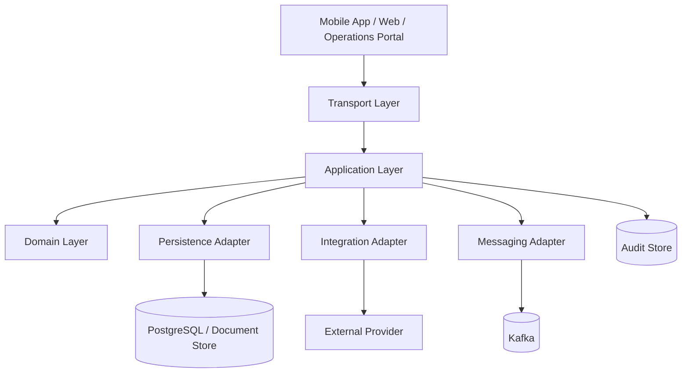

# Reference Architecture Standard

## Purpose

Provide a reusable Java-first reference architecture for enterprise digital banking services, channel apps, diagrams, observability, and deployment.

## Service Reference Architecture



## Backend Folder Structure

```text
service-name/
├── build.gradle or build.gradle.kts
├── settings.gradle or settings.gradle.kts
├── openapi/
├── asyncapi/
├── helm/
├── src/main/java/com/<company>/<domain>/<service>/
│   ├── Application.java
│   ├── transport/
│   ├── application/
│   ├── domain/
│   ├── persistence/
│   ├── integration/
│   ├── messaging/
│   ├── security/
│   ├── observability/
│   └── config/
└── src/test/java/com/<company>/<domain>/<service>/
    ├── unit/
    ├── component/
    ├── integration/
    ├── contract/
    └── performance/
```

## C4 Modeling

| Level | Audience | Content |
| --- | --- | --- |
| Level 1 System Context | Business stakeholders, product, architects | Users, external systems, major dependencies, trust boundaries. |
| Level 2 Container | Engineers, SRE, security | Deployable units, protocols, databases, queues, identity providers, external providers. |
| Level 3 Component | Engineers | Controllers, application services, domain policies, repositories, adapters, event publishers. |
| Level 4 Code | Lead engineers | Optional for complex patterns only. |

## Sequence Diagram Rules

- Show named actors, systems, services, and datastores.
- Label transport mechanism and operation name.
- Include key identifiers such as correlation ID, entity ID, request ID, and idempotency key where they drive behavior.
- Use `alt`, `opt`, and `loop` for material branches.
- Show response status and payload name, not full JSON bodies.
- Mark steps as existing, new, or target-state when the diagram is part of a change design.
- Call out security validation and business rule references where they determine the branch.
- Keep raw SQL, full request bodies, and framework internals outside sequence diagrams.

## Data Flow Diagram Rules

- Use DFDs for sensitive data movement, regulatory scope, PCI scope, and threat modeling.
- Data must flow through a process, not directly between external entities or data stores.
- Mark trust boundaries and encryption boundaries.
- Annotate flows carrying sensitive data.
- Confirm every process has at least one input and one output.

## Observability

Services must emit:

- structured JSON logs
- W3C trace context
- OpenTelemetry traces
- Micrometer metrics
- correlation IDs in inbound and outbound calls
- audit evidence for material business actions

Golden signals:

- latency
- traffic
- errors
- saturation

Recommended metric naming:

```text
bank.<domain>.<service>.<metric_name>.<unit>
```

## Deployment

Each service should include Helm chart assets:

```text
helm/
├── Chart.yaml
├── values.yaml
├── values-dev.yaml
├── values-staging.yaml
├── values-prod.yaml
└── templates/
    ├── deployment.yaml
    ├── service.yaml
    ├── serviceaccount.yaml
    ├── ingress.yaml
    ├── configmap.yaml
    └── secrets.yaml
```

Runtime standards:

- use non-root containers
- restrict privilege escalation
- prefer read-only root filesystem
- define CPU and memory requests and limits
- use liveness and readiness probes
- use network policies for ingress and egress
- source secrets from approved secret managers
- package Helm charts with semantic versions independent of application versions

